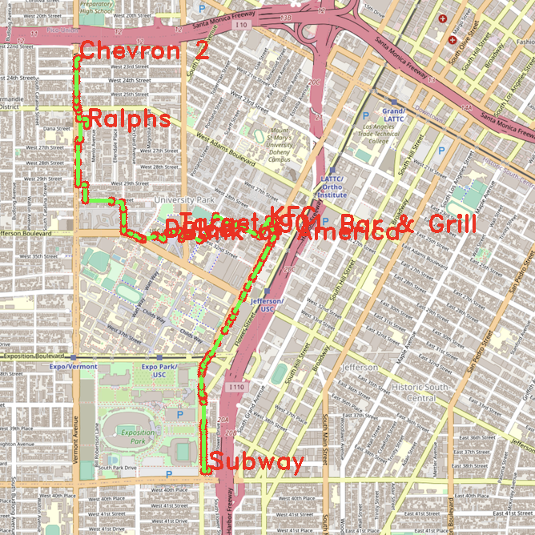

### Video Presentation Submission 

Here is [my video presentation link](https://www.youtube.com/watch?v=7BAHyecpNIc) 

# Report 

## Function 1: Autocomplete

This function searches for and returns all node names in the dataset that begin with a given partial name. This search is case-insensitive and helps users identify locations with similar prefixes.

Algorithm Architecture
- Converts the input string to lowercase
- Iterates over all nodes in the graph
- Converts each node's name to lowercase
- Checks if the input string matches the prefix of the node’s name
- Collects matching names into a result vector

Data Structure(s) Involved
- data.cvs is used as an unordered map that stores node data with a node ID as the key and a Node object as the value
- String (input)
- Vector (output that stores list of names)

Runtime
- The runtime is O(n) because it must traverse all the nodes in the map and compare each node's name with the input string. If a different data structure, such as a tree, was used then the runtime could be faster than O(n).

| Input Character # | Output Location # | Time | 
| -------------------- | -------------------- |-----|
|                 1     |     9  |8 |
|                 2   |     2  | 6 |
|                 3    |      1 | 7|

## Function 2: Find the location 
This function retrieves geographical coordinates for a given location. In the mapui.cc, if a name does not match, it uses FindClosestName() which calls EditDistance() to return the name with the smallest edit distance using dyanmic programming. 

Algorithm Architecture
- Iterate over all nodes in the map 
- Compare each node’s name (case-insensitively) with the input name
- Return the latitude and longitude of the matching node
- If no match is found, return an invalid result

Data Structure(s) Involved
- data.csv is used as unordered map where the key is the node ID, and the value is a Node object containing details like name, latitude and longitude
- String (input) 
- Pair (output)

Runtime
- The runtime is O(n) because it iterates through all nodes.

Time taken by function: 10 ms

## Function 3: Find all location categories
This function identifies and returns all unique location categories across the dataset. It ensures there are no duplicate categories in the output.

Algorithm Architecture
- Iterate through every node in the unordered map data
- For each node, access the attributes vector, which contains location categories
- Use std::find to check if an attribute already exists in the categories vector
- If an attribute is not found in categories, append it to the vector
- Return the final vector of unique categories

Data Structure(s) Involved
- unordered map (data.csv)
- vector (categories)

Runtime
- The runtime is O(nxm) because the function iterates over all nodes and the attributes for each node. 

Time taken by function: 5 ms

## Function 4: Get all locations of a category 
This function retrieves the IDs of all locations in the dataset that match a given category (case-insensitive). If no locations match, the function returns an empty vector.

Algorithm Architecture
- Convert the input category string to lowercase
- Iterate over all nodes in the map
- For each node, iterate over its attributes
- Convert each attribute to lowercase
- Compare the attribute with the input category
- If a match is found, add the node's ID to the results
- Return the vector containing all matching IDs

Data Structure(s) Involved
- unordered map (data.csv)
- string (input)
- vector (output)

Runtime
- The runtime is O(nxm) because the function iterates over all nodes and the attributes for each node. 

| Input Category       |   Output Location #  |Time | 
| -------------------- | -------------------- |-----|
| bank                 | 3                    | 4   |
| restaurant           | 24                   | 4   | 
| clothes              | 6                    | 6   | 

## Function 5: Get location matching regular expression
This function retrieves all locations that match a given regular expression. It ensures the flexibility to search for complex patterns in location names.

Algorithm Architecture
- Iterate over all nodes in the map
- Use the std::regex_match function to check if the node's name matches the provided regular expression
- If a match is found, add the node's ID to the result vector
- Return all matching IDs

Data Structure(s) Involved
- unordered map (data.csv)
- string (input)
- vector (output)

Runtime
- The runtime is O(nxm) where n is the number of nodes in the map, and m is the average length of the node names being matched.

Time taken by function: 40 ms

## Function 6: Calculate Shortest Path 
This function calculates the shortest path between two locations using two algorithms: Dijkstra's and Bellman-Ford. Dijkstra's is a greedy algorithm efficient for graphs without negative weights, while Bellman-Ford handles graphs with negative weights and allows early termination

### Dijkstra
Algorithm Architecture
- Retrieve the IDs of the starting and target locations using GetID()
- Initialize a priority queue (std::priority_queue) to store nodes with their current shortest distances
- Use a distance map to track the shortest known distance from the starting node to each node
- Traverse neighbors of the current node, update their distances, and push them into the queue if a shorter path is found
- Continue until the target node is reached or all nodes are processed
- Reconstruct the path from the target node back to the starting node using a map of predecessors

Data Structure(s) Involved
- Priority queue
- Unordered map 

Runtime
- The runtime is O((m+n)logn) because it processes each node (n) and each edge (m) while maintaining a priority queue, where each insertion and deletion operation takes O(log(n)).

### Bellman-Ford

Algorithm Architecture
- Retrieve the IDs of the starting and target locations using GetID()
- Initialize a distance map with infinite values and set the distance of the starting node to 0
- Relax all edges up to V-1 times, where V is the number of nodes
- Update distances for each edge if a shorter path is found
- If no distance updates are made in a relaxation round, terminate early (optimization)
- Reconstruct the path from the target node back to the starting node using a map of predecessors

Data Structure(s) Involved
- Unordered map

Runtime
- The runtime is O(m✕n) because it relaxes all edges (m) for up to n−1 iterations.

### Runtime Comparison

| Point A → Point B                 | Dijkstra (ms) | Bellman-Ford (ms) | Path Distance (miles) |
|-----------------------------------|---------------|-------------------|-----------------------|
| Ralphs → Chick-fil-A              | 113           | 10124             | 1.49919 |
| Parkside Dining Hall → Five Guys  | 107           | 10674             | 1.31657 |             
| Subway → Bank of America          | 81            | 9945              | 1.10296 |            
| 901 Bar & Grill → USC Village Gym | 62            | 11446             | 0.656042|             
| Lululemon → Chase                 | 21            | 9479              | 0.347028|           
| Insomnia Cookies → Basketball Courts| 160            | 9230           | 1.72417 |             
| Studio 423 → 7-Eleven             | 78            | 14069             | 1.0981  |            
| Popeyes → Parking Center          | 77            | 10886             | 0.863791|             
| Workshop Salon & Boutique → Chipotle| 67          | 9721              | 0.767638|            
| Stout Burger → The Barber Shop    | 145           | 9400              | 1.57411 |              
| Starbucks 2 → Honda               | 151           | 10240             | 1.83641 |            
| George Tirebiter → KFC            | 72            | 12296             | 0.867269|             
| LycaMobile → Burger King          | 175           | 11226             | 1.91668 |              
| Hoover & 30th → Village Cobbler   | 29            | 10452             | 0.177054|           
| Fruit and Candy → Exposition & Watt| 58           | 9670              | 0.649967|              
| Chevron 2 → Dulce                 | 67            | 12329             | 1.0875  |              

## Function 7: Cycle Detection
This function determines whether a cycle exists in a given subgraph of the map. It performs a depth-first search (DFS) on the graph, marking nodes as visited and checking for back edges, which indicate a cycle.

Algorithm Architecture
- Initialize all nodes in the subgraph as unvisited using an unordered map.
- Use a stack to perform a DFS traversal.
- Visit each node and mark it as visited.
- For each neighbor:
    - Skip neighbors not part of the subgraph.
    - Push unvisited neighbors to the stack along with their parent node.
    - If a visited neighbor is not the parent node, a cycle is detected.
- Return true if a cycle is found, otherwise return false

Data Structure(s) Involved
- Unordered map
- Stack
- Subgraph
- Square 

Runtime
- The runtime is the same as DFS, O(n+m)

Time taken by function: 0 ms

## Function 8: Topological Sort
This function checks if a cycle exists within a subgraph defined by a square boundary.

Algorithm Architecture
- Initialization: Create a graph for dependencies and a map to track prerequisites
- Build graph: Update the graph and increment prerequisites for dependent nodes
- Queue processing: Add locations with no prerequisites to a queue
- Topological sorting: Process the queue, adding locations to the result and updating prerequisites
- Cycle detection: Return an empty vector if not all locations are included

Data Structure(s) Involved
- Graph (unordered map)
- Map
- Queue
- Vector

Runtime
- The runtime is O(n+m), where n is the number of locations and m is the number of dependencies.

Note: However, I understand that as the input size grows, the runtime complexity increases significantly. Specifically, I recognize that the runtime for topological sort is dependent on traversing the nodes and edges of the graph, which scales with the size of the graph.

## Function 9: Traveling Salesman
This function finds the shortest round-trip route visiting all given locations using three different methods: Brute Force, Backtracking, and 2-opt Heuristic. 

### Brute Force
Algorithm Architecture
- Generate all permutations of the locations except the starting point
- Add the starting point at the beginning and end of each permutation to complete the round trip
- Calculate the total distance for each path.
- Track and return the path with the minimum distance

Data Structure(s) Involved
- Vector
- String
- Pair 

Runtime
- The runtime is O(n!) because it evaluates all permutations of n locations

### Backtracking
Algorithm Architecture
- Use recursive backtracking to build paths incrementally
- Prune paths early if their current distance exceeds the shortest distance found so far
- Track visited locations to avoid revisiting nodes

Data Structure(s) Involved
- Vector
- String
- Priority Queue
- Stack

Runtime
- The runtime is O(n!) and avoids evaluating many paths by identifying and skipping "bad" paths early. 

### 2-opt
Algorithm Architecture
- Start with an initial path (visiting nodes in the order given)
- Iteratively optimize the path by swapping two edges and checking if the total distance improves
- Repeat until no further improvements can be made

Data Structure(s) Involved
- Vector
- Priority Queue
- String

Runtime
- The runtime is O(n^2) where the number of iterations depends on the input size and the starting path.

### Comparison 
| Number of Nodes | Brute-Force (ms) | Backtracking (ms) | 2-opt (ms) |
|------------------|------------------|-------------------|------------|
| 4                | 0                | 0                 | 0          |
| 6                | 2                | 1                 | 0          |
| 8                | 101              | 31                | 1          |
| 10               | 5023             | 156               | 3          |
| 12               | timeout          | 934               | 8          |

## Function 10: Find Nearby
This function identifies nearby locations that match a specific class attribute within a given radius from a reference location. It returns a list of up to k nearby locations sorted by distance.

Algorithm Architecture
- Retrieve the ID of the reference location using GetID()
- Iterate over all nodes in the graph:
    - Skip nodes that do not match the specified class or are the same as the reference node
    - Compute the distance from the reference location using CalculateDistance ()
    - Check if the distance is within the specified radius
    - If yes, add the node's ID and distance to a vector
- Sort the vector by distance in ascending order
- Extract the IDs of up to k nearest locations from the sorted vector
- Return the resulting list of IDs

Data Structure(s) Involved
- Unordered map
- Vector
- String

Runtime
- The runtime is O(n+m(log(m))) because it iterates through all nodes to filter by distance (O(n)) and then sorts the m nodes within the radius by distance O(mx(log(m))).

### When searching for restaurants with Dulce as the input location 
| Radius (r) | Maximum Results (k) | Time (ms) | Output                             |
|------------|----------------------|-----------|------------------------------------|
| 1.0        | 5                    | 31        | 1 Kobunga Korean Grill            |
|            |                      |           | 2 Ramen KenJo                     |
|            |                      |           | 3 SunLife Organics                |
|            |                      |           | 4 CAVA                            |
|            |                      |           | 5 Il Giardino                     |
| 5.0        | 10                   | 33        | 1 Kobunga Korean Grill            |
|            |                      |           | 2 Ramen KenJo                     |
|            |                      |           | 3 SunLife Organics                |
|            |                      |           | 4 CAVA                            |
|            |                      |           | 5 Il Giardino                     |
|            |                      |           | 6 Chinese Street Food             |
|            |                      |           | 7 Little Galen Center             |
|            |                      |           | 8 Everybody's Kitchen             |
|            |                      |           | 9 Moreton Fig                     |
|            |                      |           | 10 Parkside Dining Hall           |
| 10.0       | 15                   | 22        | 1 Kobunga Korean Grill            |
|            |                      |           | 2 Ramen KenJo                     |
|            |                      |           | 3 SunLife Organics                |
|            |                      |           | 4 CAVA                            |
|            |                      |           | 5 Il Giardino                     |
|            |                      |           | 6 Chinese Street Food             |
|            |                      |           | 7 Little Galen Center             |
|            |                      |           | 8 Everybody's Kitchen             |
|            |                      |           | 9 Moreton Fig                     |
|            |                      |           | 10 Parkside Dining Hall           |
|            |                      |           | 11 23rd Street Cafe               |
|            |                      |           | 12 Bacari W Adam?                 |
|            |                      |           | 13 Holbox                         |
|            |                      |           | 14 Birds Nest Cafe - Adams Normandie |
|            |                      |           | 15 Holy Green                     |

## Function 11: Find Path to Visit All Places
This function finds the shortest path visiting all locations without returning to the start. 

Algorithm Architecture
- Convert the location names to IDs using GetID() 
- Precompute the shortest paths between all pairs of nodes using CalculateShortestPath_Dijkstra() and store the distances and paths in a nested map (shortest_paths)
- Generate all permutations of the given locations (excluding the starting point) to evaluate every possible path
- For each permutation:
    - Calculate the total path length using the precomputed shortest paths
    - Track the shortest path and update the result if a shorter path is found
- Return the shortest path after evaluating all permutations

Data Structure(s) Involved
- Graph
- Unordered Map
- Vector
- String

Runtime
- The runtime is O(n!) because the funciton evaluates all n! permutations of the input locations.

| Number of Nodes | Time (ms) |
|------------------|-----------|
| 4               | 882        |
| 5               | 1221       |
| 6               | 1707       |
| 7               | 2440       |
| 8               | 5348       |

List of Places
1. Ralphs
2. KFC
3. Subway
4. Bank of America
5. Dulce
6. 901 Bar & Grill
7. Target
8. Chevron 2 

## Function 12: Check If Path Exists with Constraint
This function determines if a path exists between two nodes given a gas tank limit.

Algorithm Architecture
- Ensure the query includes exactly two locations
- Retrieve IDs for the locations and check if they exist in the dataset.
- Breadth-First Search (BFS): 
    - Use a queue to explore paths from the start location to the destination
    - Skip nodes that have already been visited or exceed the gas limit
- If the destination is reached during BFS, the path exists! (otherwise it does not)

Data Structure(s) Involved
- Unordered Map
- Queue
- Set
- String
- Vector 

Runtime
- The runtime is O(n+m) because it uses BFS to check path feasibility within the constraint (amount of gas).

| Start Location         | Destination          | Gas Tank Volume (gallons) | Path Exists |
|-------------------------|----------------------|---------------------------|-------------|
| Parkside Dining Hall   | Subway               | 0.05                      | No          |
| Target                 | Ralphs               | 0.05                      | Yes         |
| Bank of America        | Dulce                | 0.02                      | No          |

Time taken by function: 287 ms

## Discussion/Conclusion/Lessons Learned
This project provided a comprehensive understanding of graph-based problems and algorithms such as Dijkstra, Bellman-Ford, Traveling Salesman Problem (TSP), and Topological Sorting. It demonstrated the trade-offs between different approaches and how algorithm complexity affects runtime for large datasets. Precomputing shortest paths and optimizing memory usage were critical for improving runtime and efficiency.

I can conclude that efficient graph traversal and pathfinding algorithms are essential for solving real-world problems like route optimization and navigation. While brute-force methods guarantee correctness, their scalability is limited. Heuristic approaches such as 2-opt and backtracking provide near-optimal solutions for larger inputs. 

I learned that choosing the right algorithm depends on the problem size and constraints.For a beginner in C++, understanding the difference between brute force, backtracking, and heuristic methods highlighted the importance of choosing the right approach based on problem constraints. Debugging errors was sometimes challenging but overall a valuable learning experience. 

## Extra Credit
- Planned on doing UI implementation but spoke with professor that there were issues with ncurses :( 